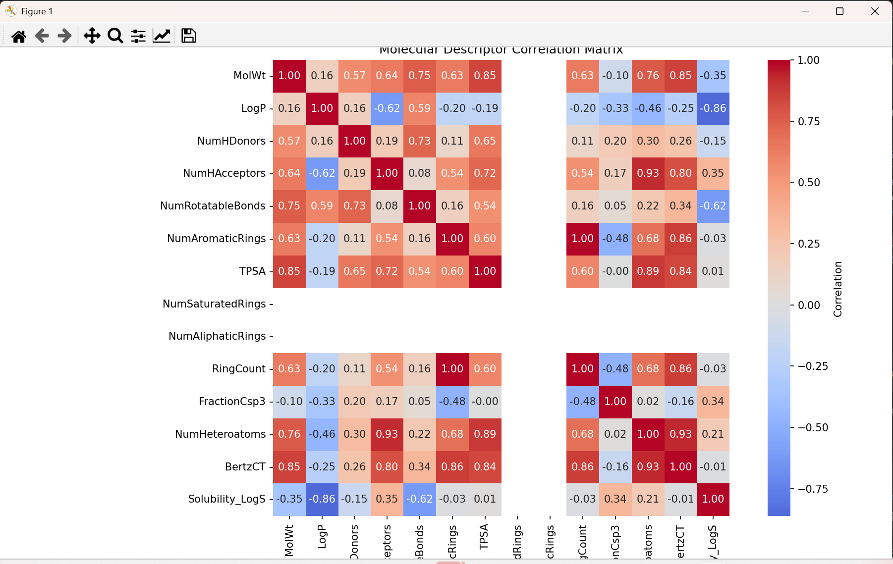

# Molecular Property Predictor

A cheminformatics project that predicts aqueous solubility of molecules using RDKit descriptors and machine learning.

## Table of Contents
- [Overview](#overview)
- [Features](#features)
- [Prerequisites](#prerequisites)
- [Installation](#installation)
- [Project Structure](#project-structure)
- [Usage](#usage)
- [Understanding the Code](#understanding-the-code)
- [Results and Interpretation](#results-and-interpretation)
- [Troubleshooting](#troubleshooting)
- [Next Steps](#next-steps)
- [Resources](#resources)

## Overview

This project demonstrates how to:
- Calculate molecular descriptors from chemical structures using RDKit
- Build machine learning models to predict molecular properties
- Visualize and analyze chemical data
- Evaluate model performance

**What is molecular property prediction?**
Molecular property prediction is the task of predicting physical, chemical, or biological properties of molecules based on their chemical structure. In this project, we predict aqueous solubility (LogS), which measures how well a molecule dissolves in water.

## Features

- **Molecular Descriptor Calculation**: Computes 13 key molecular descriptors including:
  - Molecular weight
  - LogP (lipophilicity)
  - Hydrogen bond donors/acceptors
  - Topological polar surface area (TPSA)
  - Ring counts and more

- **Machine Learning Models**:
  - Random Forest Regressor (default)
  - Linear Regression (alternative)
  - Cross-validation for robust evaluation

- **Comprehensive Visualizations**:
  - Predicted vs. actual plots
  - Feature importance analysis
  - Residual plots
  - Correlation heatmaps

## Prerequisites

Before starting, you should have:
- Basic knowledge of Python programming
- Basic understanding of chemistry (SMILES notation is helpful)
- A computer running Windows, macOS, or Linux

## Installation

Follow these steps carefully to set up the project on your machine.

### Step 1: Install Miniconda

Miniconda is a minimal conda installer that helps manage Python packages and environments.

#### Windows:
1. Download Miniconda:
   ```powershell
   Invoke-WebRequest -Uri "https://repo.anaconda.com/miniconda/Miniconda3-latest-Windows-x86_64.exe" -OutFile ".\Downloads\Miniconda3-latest-Windows-x86_64.exe"
   ```

2. Run the installer:
   ```powershell
   .\Downloads\Miniconda3-latest-Windows-x86_64.exe
   ```

3. During installation, make sure to check "Add Miniconda to PATH"

4. After installation, close and reopen your terminal

5. If conda is not recognized, run:
   ```powershell
   # In PowerShell, enable script execution:
   Set-ExecutionPolicy -ExecutionPolicy RemoteSigned -Scope CurrentUser

   # Then initialize conda:
   C:\Users\YourUsername\miniconda3\Scripts\conda.exe init powershell

   # For Git Bash:
   /c/Users/YourUsername/miniconda3/Scripts/conda.exe init bash
   ```

6. Close and reopen your terminal

#### macOS/Linux:
```bash
# Download and install
wget https://repo.anaconda.com/miniconda/Miniconda3-latest-Linux-x86_64.sh
bash Miniconda3-latest-Linux-x86_64.sh

# Follow the prompts and restart your terminal
```

### Step 2: Create a Conda Environment

A conda environment is an isolated space where you can install packages without affecting other projects.

```bash
# Create a new environment named 'molprop' with Python 3.10
conda create -n molprop python=3.10 -y

# Activate the environment
conda activate molprop
```

**Note**: You'll need to activate this environment every time you work on this project.

### Step 3: Install Required Packages

Install all the necessary Python packages:

```bash
# Install scientific computing packages
conda install -c conda-forge rdkit numpy pandas scikit-learn matplotlib seaborn -y
```

**What each package does**:
- **rdkit**: Chemistry toolkit for molecular descriptor calculation
- **numpy**: Numerical computing library
- **pandas**: Data manipulation and analysis
- **scikit-learn**: Machine learning library
- **matplotlib**: Plotting library
- **seaborn**: Statistical data visualization

### Step 4: Download the Project

```bash
# Navigate to your desired directory
cd ~/Desktop/ChemInformatics-Projects

# If using git:
git clone <your-repo-url>
cd "Molecular Property Predictor"

# Or simply download the files manually and navigate to the folder
```

## Project Structure

```
Molecular Property Predictor/
│
├── molecule_predictor.py    # Main Python script
├── requirements.txt /yml         # List of required packages
└── README.md                 # This file
```

## Usage

### Basic Usage

1. **Activate your conda environment**:
   ```bash
   conda activate molprop
   ```

2. **Run the main script**:
   ```bash
   python molecule_predictor.py
   ```

3. **What happens when you run it**:
   - Creates a dataset of 500 molecules
   - Calculates molecular descriptors
   - Analyzes descriptor correlations
   - Trains a Random Forest model
   - Displays visualizations
   - Tests predictions on sample molecules

### Expected Output

```
🧪 Molecule Property Predictor - Cheminformatics Project
============================================================

1. Creating sample dataset...
Creating sample molecular dataset...
Calculating descriptors for 500 molecules...
Processed 100 molecules...
...
Successfully processed 500 out of 500 molecules

2. Analyzing molecular descriptors...
...

3. Training machine learning model...
Model Performance:
Training R²: 0.XXX
Test R²: 0.XXX
...

4. Creating visualizations...
[Plots will be displayed]

5. Testing predictions on new molecules...
Aspirin: Predicted LogS = -X.XX
Ibuprofen: Predicted LogS = -X.XX
...

🎉 Project completed successfully!
```

## Understanding the Code

### Main Components

#### 1. MoleculePropertyPredictor Class

The core class that handles all operations:

```python
predictor = MoleculePropertyPredictor()
```

**Key Methods**:
- `calculate_descriptors()`: Converts SMILES to molecular descriptors
- `create_sample_data()`: Generates synthetic dataset for demonstration
- `train_model()`: Trains the machine learning model
- `predict_molecule()`: Predicts solubility for new molecules
- `analyze_descriptors()`: Analyzes descriptor statistics and correlations

#### 2. SMILES Notation

SMILES (Simplified Molecular Input Line Entry System) is a text-based representation of chemical structures.

**Examples**:
- `CCO` = Ethanol (CH₃CH₂OH)
- `C1=CC=CC=C1` = Benzene ring
- `CC(=O)O` = Acetic acid

#### 3. Molecular Descriptors

Features calculated from molecular structure:

- **MolWt**: Molecular weight (g/mol)
- **LogP**: Partition coefficient (lipophilicity measure)
- **NumHDonors**: Number of hydrogen bond donors
- **NumHAcceptors**: Number of hydrogen bond acceptors
- **TPSA**: Topological polar surface area
- **NumRotatableBonds**: Number of rotatable bonds
- And more...

#### 4. Model Training

The project uses Random Forest Regressor by default:

```python
results = predictor.train_model(df, model_type='rf')
```

**Evaluation Metrics**:
- **R² Score**: Measures how well the model explains variance (closer to 1 is better)
- **RMSE**: Root Mean Square Error (lower is better)
- **Cross-validation**: Tests model on different data splits

## Results and Interpretation

### Visualization Plots

1. **Training Set Plot**: Shows how well the model fits training data
2. **Test Set Plot**: Shows model performance on unseen data
3. **Feature Importance**: Shows which descriptors are most important
4. **Residual Plot**: Shows prediction errors (should be randomly scattered around 0)

### Understanding LogS Values

LogS is the logarithm of aqueous solubility (mol/L):
- **LogS > -2**: Highly soluble
- **-2 > LogS > -4**: Moderately soluble
- **-4 > LogS > -6**: Slightly soluble
- **LogS < -6**: Poorly soluble

## Troubleshooting

### Common Issues

#### 1. `conda: command not found`

**Solution**:
```bash
# Windows PowerShell:
Set-ExecutionPolicy -ExecutionPolicy RemoteSigned -Scope CurrentUser
C:\Users\YourUsername\miniconda3\Scripts\conda.exe init powershell

# Git Bash:
/c/Users/YourUsername/miniconda3/Scripts/conda.exe init bash

# Then restart your terminal
```

#### 2. `ModuleNotFoundError: No module named 'rdkit'`

**Solution**:
```bash
# Make sure your environment is activated
conda activate molprop

# Reinstall rdkit
conda install -c conda-forge rdkit -y
```

#### 3. `AttributeError` in RDKit functions

**Solution**: Make sure you're using the correct function names:
- Use `CalcFractionCSP3` (not `CalcFractionCsp3`)
- Import `GraphDescriptors` for `BertzCT`

#### 4. Plots not showing

**Solution**:
```bash
# On some systems, you may need to set the backend
# Add this to the top of the script:
import matplotlib
matplotlib.use('TkAgg')  # or 'Qt5Agg'
```

## Next Steps

Once you've successfully run the project, try these extensions:

### Beginner Level
1. **Change the number of samples**:
   ```python
   df = predictor.create_sample_data(n_samples=1000)  # Try 1000 instead of 500
   ```

2. **Test your own molecules**:
   ```python
   my_molecule = "CC(C)O"  # Isopropanol
   pred, status = predictor.predict_molecule(my_molecule)
   print(f"Predicted LogS: {pred}")
   ```

3. **Try Linear Regression**:
   ```python
   results = predictor.train_model(df, model_type='linear')
   ```

### Intermediate Level
1. **Use real datasets**: Download solubility data from ChEMBL or PubChem
2. **Add more descriptors**: Explore Morgan fingerprints or other RDKit descriptors
3. **Try different ML algorithms**: SVM, Gradient Boosting, Neural Networks
4. **Feature selection**: Identify and remove redundant descriptors

### Advanced Level
1. **Build a web interface**: Use Flask or Streamlit to create a web app
2. **Implement uncertainty quantification**: Add prediction confidence intervals
3. **Multi-task learning**: Predict multiple properties simultaneously
4. **Deep learning**: Use graph neural networks for molecule property prediction

## Resources

### Learning Materials

- **RDKit Documentation**: https://www.rdkit.org/docs/
- **Scikit-learn User Guide**: https://scikit-learn.org/stable/user_guide.html
- **Cheminformatics Introduction**: https://www.youtube.com/results?search_query=cheminformatics+tutorial

### Datasets

- **ChEMBL**: https://www.ebi.ac.uk/chembl/
- **PubChem**: https://pubchem.ncbi.nlm.nih.gov/
- **MoleculeNet**: http://moleculenet.org/
- **ESOL Dataset**: Delaney solubility dataset (classic benchmark)

### SMILES Resources

- **SMILES Tutorial**: https://www.daylight.com/dayhtml/doc/theory/theory.smiles.html
- **SMILES Drawer**: https://www.simolecule.com/cdkdepict/depict.html

### Python/ML Resources

- **Python for Data Science**: https://www.kaggle.com/learn/python
- **Machine Learning Crash Course**: https://developers.google.com/machine-learning/crash-course

## Contributing

If you find bugs or have suggestions for improvements:
1. Document the issue clearly
2. Provide example code if possible
3. Share via mugaojoy@gmail.com

### Sample Output

